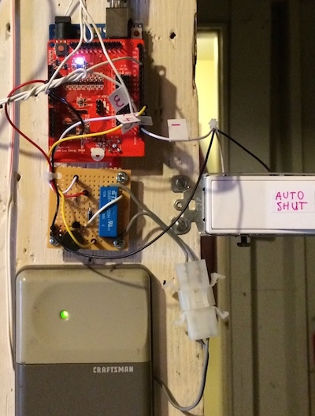
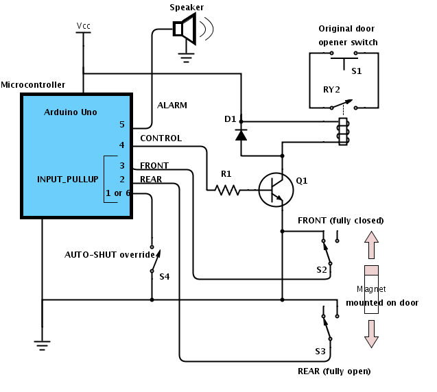
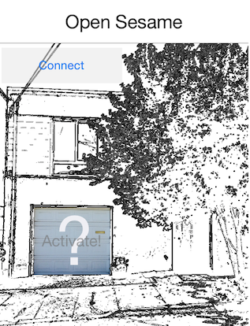

# README

GarageDoor is a simple app that demonstrates how you can open/close your garage door remotely using an Arduino, iOS app and Pebble smartwatch.

It has a few interesting features:

* digital signature verification of incoming control (open/close) messages
* requirement to fetch a partial key before every control message to mitigate replay attacks
* auto-shut logic (with switch override) to shut the door if it's open for more than N seconds
* simple pebble watch app to allow control from the wrist

## Hardware required
* [Arduino Uno](http://arduino.cc/en/Main/arduinoBoardUno) (it will probably work with other variants, but I've only tested it with the Uno)
* RedBearLab's [BLE shield](http://redbearlab.com/bleshield/)
* magnetic reed switches to detect the open/partially-open/closed state of the door (I used two [Philmore switches](http://www.amazon.com/gp/product/B004PARDRO))
* SPDT switch to enable/disable auto-shut logic
* interposing relay (with NPN transistor, flyback diode, and resistor) to control the garage door and buzzer to alert the user about pending door closure due to auto-shut logic
* Bluetooth LE-capable iOS device (iPhone 4S or later)
* Pebble watch (optional)

Here's the setup in my garage:

## Schematic

## Communications

Communications from the iOS app to the Arduino is facilitated by the simple Tx/Rx transport mechanism exposed by RedBearLab's BLE library.

The format of request messages from the iOS app to the Arduino is:

* signature (16 bytes - MD5 hash of the 4-byte message payload and 8-byte encrytion key)
* command (1 byte) - kCmdGetKeyPart, kCmdControl, kCmdGetStatus
* sequence number (1 byte)
* data 1 (1 byte)
* data 2 (1 byte)

Response messages have the following format:

* response signature (1 byte)
* sequence number (1 byte)
* response code (1 byte)
* additional payload length (1 byte)
* payload (0..N-1 bytes)

There are three shared header files between the various components:

* shared_key.h: defines the 4-byte shared key between the Arduino sketch and iOS app.  An additional 4-byte partial key is fetched before any control command is sent from the app.
* shared_protocol.h: defines the 1-byte commands that are sent from the iOS app to the Arduino as well as the various response codes.
* shared_pebble.h: defines the simple commands and button IDs that are used between the iOS app and (optional) Pebble smartwatch.

## Dependencies

Arduino libraries:

* MD5: iOS and Arduino-compatible MD5 library, based on [ArduinoMD5](https://github.com/tzikis/ArduinoMD5/)
* [TimerOne_r11](https://code.google.com/p/arduino-timerone/downloads/list)
* RBL_BLEShield (modified version to allow configuration of the primary service and characteristic UUIDs)
* Nordic_BLE

iOS app frameworks:

* [Pebble iOS SDK](https://github.com/pebble/pebble-ios-sdk)

## Usage

Here's a screenshot from the iOS app. After you press the "Connect" button, the app will scan for BLE peripherals that match the defined primary service UUID and connect to the first one that it finds (ideally, the app would prompt the user to pick one if it finds more than one).  After connection, the app will poll the Arduino to get the door's state. You can then open/shut the door by presing the door image.

## Building

If you want to build this thing, you will need to download the Pebble iOS SDK and fix the reference to the PebbleKit and PebbleVendor frameworks in the iOS app.  I tested it with PebbleSDK-2.2, but hopefully newer versions are backwards-compatible.

You should also edit shared_key.h and you might want to consider changing the primary service and characteristic UUIDs of the BLE shield using [Nordic's nRFgo Studio](https://www.nordicsemi.com/chi/node_176/2.4GHz-RF/nRFgo-Studio).

